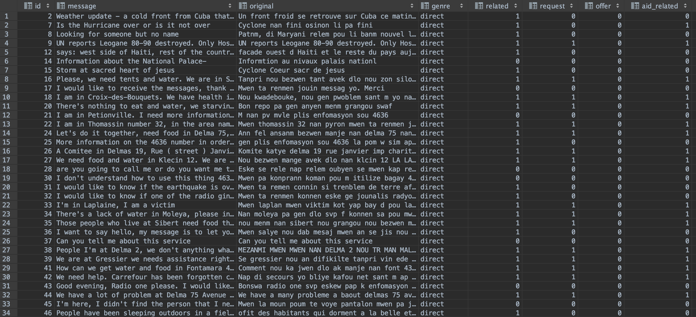
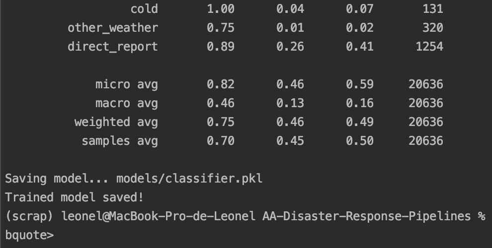
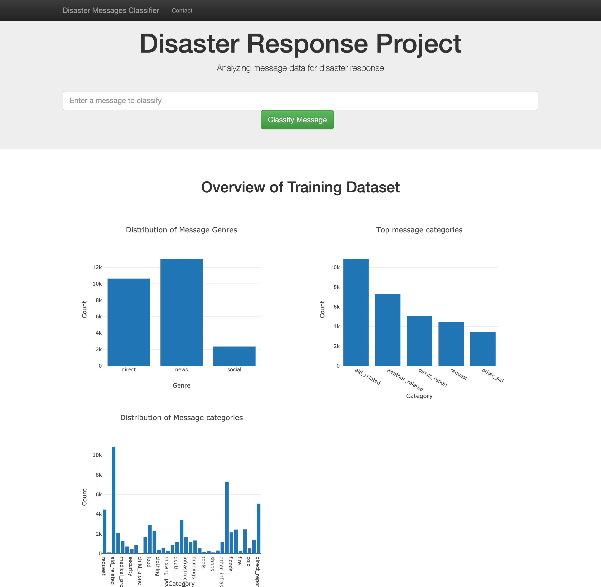

# Disaster Response AA Pipeline
This is a simple Advanced Analytics project to automatically classify emergency messages on social media.

## Overview
As part of Udacity's the DS Nanodegree, we've learned and built on data engineering skills to expand
 opportunities and potential as a data scientist. 
In this project, you'll apply these skills to analyze disaster data from Figure Eight to build a model
 for an API that classifies disaster messages.

In the Project Workspace, there's a data set containing real messages 
that were sent during disaster events. 
We will be creating a machine learning pipeline to categorize these events so that you 
can send the messages to an appropriate disaster relief agency.

The project will include a web app where an emergency worker can input 
a new message and get classification results on several categories. 
The web app will also display visualizations of the data. 
This project will show off your software skills, 
including your ability to create basic data pipelines and write clean, organized code!

## Project 
### Components 
There are three components on this project:

- ETL Pipeline
- ML Pipeline
- Visualization App

### Content
- Data
  - process_data.py: reads the data, cleans and stores it in a SQLite database. 
    usage: python process_data.py MESSAGES_DATA CATEGORIES_DATA NAME_FOR_DATABASE`
  - disaster_categories.csv  dataset provided by Figure Eight
  - disaster_messages.csv dataset provided by Figure Eight
  - DisasterResponse.db: created database from transformed and cleaned data.
- Models
  - train_classifier.py: includes the code necessary to load data, transform it with NLP, run a machine learning model using GridSearchCV and train it.
    usage: `python train_classifier.py DATABASE_DIRECTORY SAVENAME_FOR_MODEL`
    >Note: This might take a while to run.
- App
  - run.py: Flask app and the user interface used to predict results and display them.
  - templates: folder containing the html templates

### Example:
> python process_data.py disaster_messages.csv disaster_categories.csv DisasterResponse.db
> python train_classifier.py ../data/DisasterResponse.db classifier.pkl
> python run.py

### About
This project was prepared as part of the Udacity Data Scientist nanodegree programme. The data was provided by Figure Eight. 

### Instructions:

1. Run ETL pipeline that cleans data and stores in sqlite:
    `python data/process_data.py data/disaster_messages.csv data/disaster_categories.csv data/DisasterResponse.db`

2. Run ML pipeline that trains classifier and saves:
    `python models/train_classifier.py data/DisasterResponse.db models/classifier.pkl`

3. Run the flask app:
    `python app/run.py`

4. Open http://0.0.0.0:3001/ on your browser.

### Screenshots

DB

Trainer

Webapp Homepage

